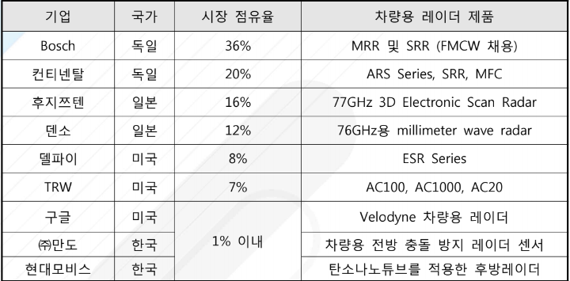

# 차량용 레이더란 - 시장 점유율

세계 차량용 레이더 시장 은 연평균 17.8%의 성장률로 2020년에는 424억 달러의 시장 규모로 크게 확대될 것으로 예측이 됩니다. 또한 국내 차량용 레이더 시장의 규모도 2015년 4,700억 원에서 연평균 15.7%씩 성장하여 2020년 에는 1조 3,015억 규모의 시장을 형성할 것으로 예상됩니다.

현재 단거리 레이더에서는 독일의 2개 업체가 56%를 점유하고 있고 일본 의 기업이 36%를 점유하고 있습니다.
 장거리 레이더의 경우는 유럽의 업체 4개가 거의 98%의 점유율을 보일 정도로 이 분야에서는 미국보다 유럽의 강세가 이어지고 있습니다.

## 참고문서
- BOSS 보고서: 3-2016-차량용레이더.pdf
