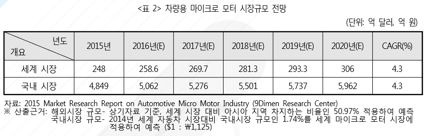

# 차랑용 마이크로 모터 - 국내시장

2014년 세계 자동차 시장규모 대비 국내 자동차 시장이 차지하는 비율인 1.74%를 차량용 마이크로 모터 시장에 적용하였을 경우, 2015년 국내 마이크로 모터 시장은 4,849억 원에서 2020년 5,962억 원 규모로 성장할 것이 예상됩니다.

## 참고문서
- BOSS 보고서: 7-2016-차량용마이크로모터.pdf
