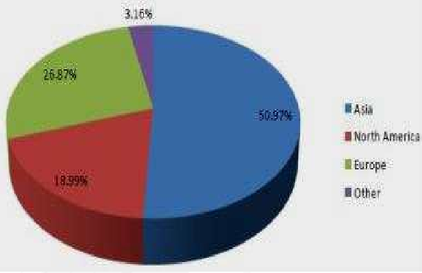

# 차랑용 마이크로 모터 - 시장 점유율

자동차용 소형 모터 시장의 주요 분류별 점유율을 살펴보면, 9Dimen Research의 조사 결과 2015년 기준, DC Brushless 모터가 전체의 58.69%를 차지하며 DC Brush 모터 41.31%보다 높은 비중을 차지 하고 있습니다.
이는 Brush가 없어 노이즈가 발생하지 않는 점, 기계적인 접촉 부분이 없어 고속으로 회전 이 가능한 점, 모터의 수명이 비교적 높다는 점을 이유로 고급 제품인 Brushless 모터의 수요 증가 때문인 것으로 보입니다.
하지만 최근 기술 동향이 Brush 모터를 거쳐 Brushless 모터로 이동을 한 것으로 해석할 수 있으나, 여전히 Brush 모터도 상당 부분 시장을 점유하고 있는 상황입니다.

차량용 마이크로 모터는 공급 측면에서 생산량과 용량이 꾸준히 증가하고 있으며, 생산량의 증가율 은 2010년~2015년 기준 평균 3.8%로 지속적인 성장세를 보이고 있습니다. 차량용 마이크로 모터는 2015 년 기준 21억 7천3백 개가 출하된 것으로 조사됩니다. 소형 모터의 경우, 자동차 부품산업의 2차, 3차 산업으로 범용성이 높아 다양한 분야에 이용이 가능한 특성이 반영된 결과로 분석됩니다.

차량용 마이크 로 모터의 주요 지역별 점유율을 살펴보면, 아시아 지역이 전체의 50.97%를 차지하여 아시아 시장에 차량용 마이크로 모터 시장이 집중된 것을 볼 수 있으며, 이는 자동차 산업을 주도하고 있는 일본과 최근 급격한 성장세를 보이는 중국의 영향으로 판단됩니다. 그 뒤를 이어, 유럽 지역 26.87%, 북미 지역 18.99%의 점유율을 차지하여, 아시아, 유럽, 북미 지역을 중심으로 차량용 마이크로 모터 시장이 형성된 것을 볼 수 있습니다.

## 참고문서
- BOSS 보고서: 7-2016-차량용마이크로모터.pdf
