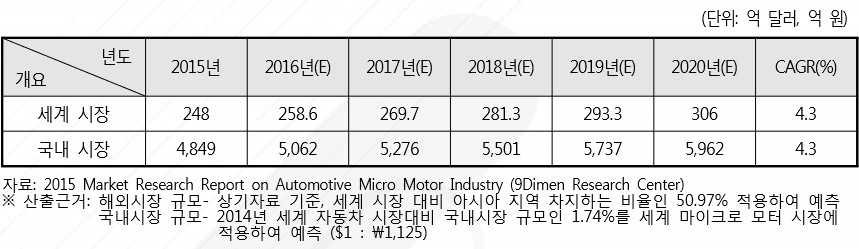

# 차랑용 마이크로 모터 - 미래시장규모

국내 소형 모터의 경우 가전제품 및 자동차 산업을 중심으로 그 수요가 예전부터 존재하고 있었습니다. 마이크로 모터는 응용범위가 아주 넓고 다품종 대량생산이 가능한 제품이며, 고급 차량의 경우 대당 백여 개 이상까지 소형 모터가 탑재되기도 합니다. 최근 친환경, 무인자동차의 잠재 성장성에도 불구하고 차량 탑승객의 안전과 편의성을 제공하는 부품 및 장치에 사용되는 마이크로 모터의 사용은 변화 하지 않을 것으로 예상되며, 자동차 부품에 사용되는 각종 차량용 마이크로 모터 산업은 자동차 수요 가 확대됨에 따라 지속적인 성장이 예상됩니다.  

차량용 마이크로 모터 시장의 경우 일본, 미국 및 유럽 등 자동차 산업에 강세를 보이는 국가들의 업체들이 높은 기술력으로 시장을 선도하고 있으며, 국내 업체의 경우 일부 소형 모터 기업들이 꾸준한 기술 개발을 통해 기술 수준 격차를 줄이고 있으나 여전히 타 업체들이 진입하기에는 어려운 것으로 판단됩니다.

국내 업체들은 이러한 점을 극복하기 위하여 넓은 범위의 차량용 마이크로 모터에서 기 능별 세부적으로 특화된 마이크로 모터의 핵심기술 개발 및 제품화 등을 고려해 볼 수 있으며, 최근 Brush 모터에서 Brushless 모터로 이동하는 기술 동향에 맞추어 제품 개발을 진행할 필요가 있습니다.

아시아 지역의 차량용 마이크로 모터 시장은 2010년 101억 9,687만 달러에서 2015년 126억 116만 달러로 4.3%의 연평균 성장률을 보이고 있습니다.

이를 토대로 세계 시장을 환산해 보았을 경우 2010년 약 200억 달러에서 2015년 약 248억 달러 규모로 성장한 것으로 예측할 수 있으며, 연평균 성장률 4.3%를 적용했을 경우 2020년 306억 달러 규모의 시장이 형성될 것으로 예측됩니다.  
한편, 2014년 세계 자동차 시장규모 대비 국내 자동차 시장이 차지하는 비율인 1.74%를 차량용 마이크로 모터 시장에 적용하였을 경우, 2015년 국내 마이크로 모터 시장은 4,849억 원에서 2020년 5,962억 원 규모로 성장할 것이 예상됩니다.   

## 참고문서
- BOSS 보고서: 7-2016-차량용마이크로모터.pdf
