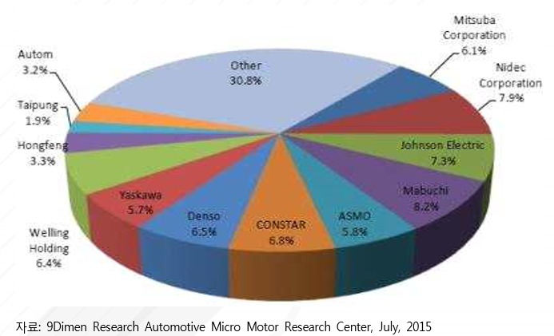

# 차랑용 마이크로 모터 - 기업별 점유율

차량용 마이크로 모터 시장을 주도하고 있는 주요 업체들은 MABUCHI MOTOR, MITSUBA, NIDEC, DENSO, ASMO, JOHNSON ELECTRIC 등이 있습니다. 자동차 부품 업체인 MITSUBA는 power window 모터, electric power steering 모터, starter 모터 등 차량용 소형 모터와 front wiper system 등의 차량용 제어장치 등 관련 기술을 선도하고 있습니다.

MITSUBA는 2010년부터 2015년 기간 동안 꾸준히 생산량이 증가하고 있으며, 2015년 기준 8억 9천 달러 생산을 기록하였습니다. 또한, 매년 약 26% 이상의 수익률을 보이고 있습니다. NIDEC은 1973년 만들어진 모터 생산회사로, 모터를 중심으로 Fans & Blowers 등 기타 차량 부품에서도 경쟁력을 보유한 기업입니다. 특히 Brush 모터와 Brushless 모터 생산에 특화되어 있습니다. NIDEC은 2010년부터 2015년 기간 동안 꾸준히 생산량이 증가하고 있으며, 생산규모는 MITSUBA보다 더 큰 것으로 파악됩니다. 2015년 기준 11억 9천 달러의 생산을 기록하였으며, 매년 약 25% 이상의 수익률을 보이고 있습니다.

JOHNSON ELECTRIC은 홍콩에 본사가 있는 모션 시스템 전문 회사로, 자동차 부품 관련 모터 사업에 도 특화되어있어 모터, 솔레노이드, 스타터 등 다양한 제품을 생산하고 있습니다. JOHNSON ELECTRIC의 차량용 마이크로 모터 생산량은 2010년 기준 약 7천3백만 개에서 2015년 기준 약 8천4백만 개로 꾸준히 생산량이 증가하고 있으며, 이는 꾸준히 증가하는 자동차용 소형 모터의 수요에 따른 것으로 판단됩니다. 2015년 기준 8억 8천 달러의 생산을 기록하였으며, 매년 약 26% 이상의 수익률을 보이고 있습니다.   

일본의 전기모터 생산 업체이자 소형 모터 부분에서 높은 세계 시장 점유율을 차지하고 있는 MABUCHI MOTOR는 2014년 기준, 아시아 시장에서 가장 높은 8.2% 시장 점유율을 차지하며 차량용 마이크로 모터 기술을 선도하고 있습니다.
MABUCHI MOTOR는 꾸준히 차량용 마이크로 모터의 생산량이 증가하는 추세를 보이며, 증가율 또한 타 업체 대비 높은 것으로 파악됩니다. 생산액 기준 2010년  10억 7 백만 달러에서 2015년 13억 3천2백만 달러로 증가하였으며, 매년 약 26%의 수익률을 보이고 있습니다.

## 참고문서
- BOSS 보고서: 7-2016-차량용마이크로모터.pdf
