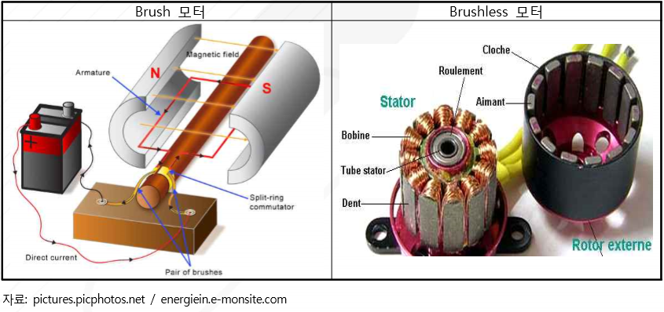

# 차랑용 마이크로 모터 - 개념

모터란 전기에너지를 운동에너지로 바꿔주는 역할을 하는 장치로서 전력원에 따라 직류 모터, 교류 모터로 나뉩니다. 차량용 마이크로 모터란 일반적으로 차량에 적용되어 직류(DC) 전원을 동력으로 사용하는 소형 모터로서, 차량의 파워트레인(Power Train), 파워 시트(Power Seat), 윈도우, 배기가스 저감장치 등 차량 구동에 사용되는 모터를 말하며, 기능에 따라 Brush 모터, Brushless 모터 등으로 나뉩니다.   

Brush 모터는 캔이라 불리는 외부 구조물 안의 내부 코일에 전류를 계속 공급해주기 위한 브러쉬라는 탄소 마찰판을 삽입한 구조이며 Brushless 모터는 마찰되는 브러쉬를 없애고 외부 구조물인 캔을 회전시키는 방식입니다.
Brush 모터는 마찰이 발생됨에 따라 에너지 손실이 발생되어 브러쉬의 마모가 발생되기 쉬우나 제작하기가 비교적 용이한 반면, Brushless 모터는 브러쉬가 닳을 걱정이 없어 반영구적으로 사용이 가능하고 일반 DC 모터 대비 약 30% 높은 효율을 가진다고 알려져 있지만 연속적인 회전을 위한 제어가 다소 어려운 점이 있습니다.          

차량용 마이크로 모터는 전후방 산업과 매우 밀접한 산업으로 각 산업별 발전에 따라 소형 정밀 모터의 응용범위가 빠르게 확산되고 있습니다. 특히 차량용 마이크로 모터 시장의 경우, 일본 업체의 영향력과 미국 및 유럽 등 자동차 산업에 강세를 보이는 국가들의 업체들이 높은 기술력으로 시장을 선도하고 있는 상황입니다.

## 참고문서
- BOSS 보고서: 7-2016-차량용마이크로모터.pdf
