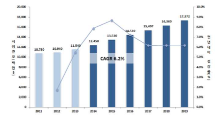

# 차량용 압력센서 - 해외시장의 크기는?
세계 차량용 센서 시장은 2013년 115억 달러에서 6.2%의 연평균 성장률을 보이며 2019년에는 174억 달러에 이르는 시장을 형성할 것으로 전망됩니다. 자동차산업의 화두로 떠오르는 스마트카 및 그린카로 인해 자동차 전장부품의 비중이 빠르게 늘어남에 따라 내외부환경의 변화를 감지하는 센서 시장이 확대될 전망입니다.

## 참고문서
- BOSS 보고서: 차량용 압력센서 기술 및 연구개발과 응용.pdf
