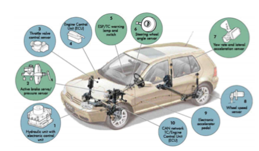

# 차량용 압력센서 - 개념

압력센서는 기체나 액체의 기본적인 물리량의 하나인 압력을 감지하 여 전기신호로 변환시킬 목적으로 사용되는 감지기로 가전제품을 비롯하여 자동차, 생체공학용 의료기, 환경 제어와 산업체의 대규모 시스템
제어 등에 광범위하게 응용되고 있습니다.

특히 차량용 압력센서는 파워트레인 제어, 주행안전제어, 보디제어 등 엔진 주변 중심으로 구동계 등에 확장 적용되고 있는 추세이며, 연비 향상, 배기가스 클린화, 안정성 향상 목적으로 적용 수량 및 활용도가 급격히 증가되고 있는 핵심 전장 부품입니다.

차량용 센서 분야는 최근 지능형 자동차 개발과 더불어 가장 큰 시장규모로 성장하고 있습니다. 현재 자동차에 적용되는 압력센서는 기계식에서 전자식으로 대부분 전환되었으며, 압력센서는 압력에 의해 변형되는 게이지부, 증폭부, 온도보상부 등으로 구성됩니다. 차량용 압력센서는 설계 및 제조 공정에서 온도, 진동, 외부의 충격, 전자기파 등의 기본 요구조건을 충족시켜야 합니다. 특히 환경 및 안전 관련 규제의 증가로 압력센서를 비롯한 다양한 센서 기술의 발달이 예상됩니다.

최근에는 마이크로프로세서 분야와 로보트 산업의 발달과 더불어 여러 산업계의 시스템이 자동화됨에 따라 효율적인 제어를 위해서 감지부의 고감도화를 수반하는 고성능화를 요구하고 있으며, 공업계측, 자동제어, 자동차, 전기용품 등에 폭넓게 이용되고 있습니다.

## 참고문서
- BOSS 보고서: 차량용 압력센서 기술 및 연구개발과 응용.pdf
