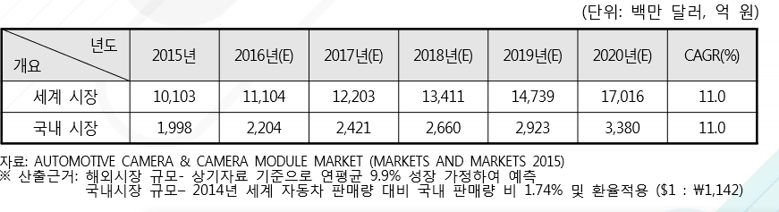

# 차량용 카메라 - 해외시장 크기

전 세계 차량용 카메라 시장규모는 2015년 기준 약 101억 3백만 달러에서 2020년까지 약 170억 1,600만 달러 규모로 성장할 것이 추정되고 연평균 성장률은 약 11.0%에 이를 것으로 전망됩니다. 지역별로는 2015년 기준 북미 시장 규모가 약 46억 5,010만 달러 규모로 가장 큰 시장을 형성하고 있는 것으로 추정되며, 시장 성장률 역시 북미 시장이 연평균 12.2%의 성장률로 전망되어 같은 기간 동안 주요 지역 중 가장 높은 성장치를 나타낼 것으로 예상됩니다.

## 참고문서
- BOSS 보고서: 4-2016-운전자의 안전과 운행의 편리함을 보장해주는 자동차용 카메라.pdf
