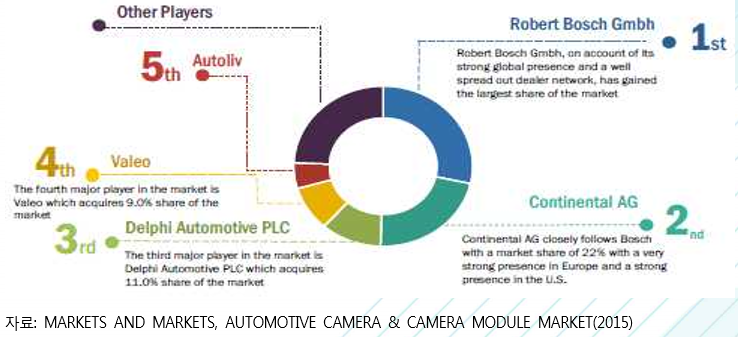

# 차량용 카메라 - 해외 참여 기업

2014년 기준 세계 차량용 카메라 및 카메라 모듈 시장은 Robert Bosch, Continental AG, Delphi Automotive, Valeo 및 Autoliv의 5개 기업이 시장을 선점하고 있습니다. Robert Bosch는 세계 차량용 카메라 및 카메라 모듈 시장에서 기술 및 서비스 제공을 주도하고 있는 업체로써, 자동차 기술, 산업 기술, 소비재, 에너지 및 건설 기술 등 네 개의 사업부문 보유하고 있습니다. Bosch 그룹은 Robert Bosch를 비롯하여 전 세계 50여 개국에 360개 이상의 계열사 및 지사를 보 유하고 있는 상황입니다. Bosch는 Daimler와 공동으로 자동 주차 기술 개발 프로젝트를 진행 중이며 이 프로젝트에서 Bosch는 주차 공간 인식 센서 및 카메라와 통신 기술을 개발하고 있습니다.

Delphi Automotive와 그 계열사들은 자동차용 카메라를 포함하는 자동차 부품을 제조하고 세계 자 동차 시장에 전기 및 전자부품, 파워트레인, 안전 및 열 기술 솔루션을 제공하고 있습니다. 사업부문은 크게 전기/전자 설계, 파워트레인 시스템, 전자제품 및 안전기술, 열 시스템 등 4가지로 분류되며, Volvo 와 파트너 쉽을 체결하여 Volvo의 XC90을 위한 가장 포괄적이고 기술적으로 정교한 표준 안전 패키지를 개발하고 있습니다. XC90은 Delphi의 Radar와 카메라 센서 통합 시스템(RACam)을 채택하고 있습니다. Continental AG는 독일의 자동차 회사이며 1871년에 고무 제조업체로 시작하여 현재 섀시 및 안전 기술, 파워트레인, 인테리어, 타이어, ContiTech, 기타 부문 등 총 6개의 사업부문을 보유하고 있으며, 영국 기반 회사인 ASL Lewes를 인수하여 이 기업의 360도 전 방향 탐지 기술에 대한 포트폴리오에 집중하고 카메라 분야에서 더 큰 경쟁력을 갖추고 있습니다.  

Valeo는 다국적 자동차 공급업체로, 넓은 범위의 부품들을 자동차 제조업체 및 부품 시장에 제공하고 있으며, 자율 주행기술 및 이산화탄소(CO₂) 배출 감소 기술 등의 개발에도 참여하고 있습니다. 사업부 문은 운전보조 시스템, 파워트레인 시스템, 열 시스템, 가시성 시스템 등을 포함하며, 운전보조 시스템 은 주행보조, 내부 전 장품, 내부 제어 부품 등을 포함하고 있다.  Autoliv는 스톡홀름에 본사를 둔 스웨덴 기업으로, Autoliv가 제공하는 제품으로는 차량용 레이더, 야 간 주행보조, 카메라 기반 시각 시스템, 브레이크 제어 및 기타 능동 안전 시스템을 포함하고 있습니다.

## 참고문서
- BOSS 보고서: 4-2016-운전자의 안전과 운행의 편리함을 보장해주는 자동차용 카메라.pdf
