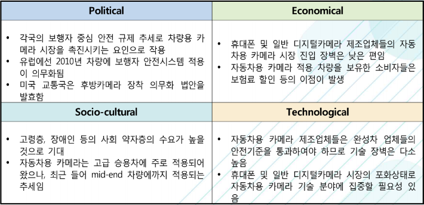

# 차량용 카메라 - PEST 분석

Political(정치적)으로는 각국의 보행자 중심 안전 규제 추세로 차량용 카 메라 시장을 촉진시키는 요인으로 작용합니다. 유럽에선 2010년 차량에 보행자 안전시스템 적용이 의무화되여 있습니다. 미국 교통국은 후방카메라 장착 의무화 법안을 발효하였습니다.

Economical(경제적)으로는 휴대폰 및 일반 디지털카메라 제조업체들의 자동차용 카메라 시장 진입 장벽은 낮은 편입니다. 자동차용 카메라 적용 차량을 보유한 소비자들은 보험료 할인 등의 이점이 발생합니다.

Socio-cultural(사회적)으로는 고령층, 장애인 등의 사회 약자층의 수요가 높을 것으로 기대됩니다. 자동차용 카메라는 고급 승용차에 주로 적용되어 왔으나, 최근 들어 mid-end 차량에까지 적용되는 추세입니다.

Technological(기술적)으로는 자동차용 카메라 제조업체들은 완성차 업체들의 안전기준을 통과하여야 하므로 기술 장벽은 다소 높습니다. 휴대폰 및 일반 디지털카메라 시장의 포화상태로 자동차용 카메라 기술 분야에 집중할 필요성 있습니다.

## 참고문서
- BOSS 보고서: 4-2016-운전자의 안전과 운행의 편리함을 보장해주는 자동차용 카메라.pdf
