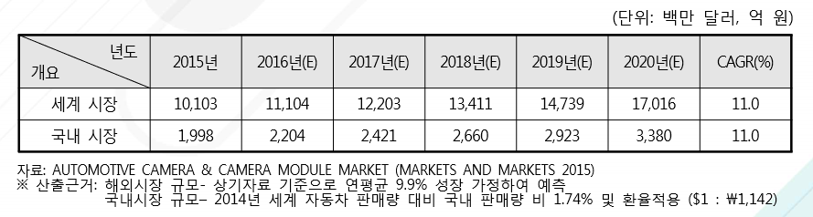

# 차량용 카메라란 - 미래시장규모

자동차용 카메라는 중형급 차량부터 최고급 자동차까지 넓은 범위에 적용되고 있으나, 고급 승용차 는 소비자의 편의성·안정성 보장의 요구가 높으며 그로 인하여 다양한 자동차 카메라 관련 기술이 적 용될 수 있습니다. 시장조사업체인 IHS에 따르면 고급차(Mercedes-Benz, BMW, 렉서스 등을 포함)에 대한 시장 수요는 2014년 833만 대에서 2020년 1,067만 대에 이를 것으로 전망됨에 따라 자동차 카메라 시장의 높은 수요가 예상됩니다. 한편, 자동차 안전에 관한 제도 등의 도입은 자동차 카메라 시장의 수요를 증가시키고 있습니다. 새 차에 대한 자동차 안전도 평가 제도(NCAP)는 차량의 안전성에 기반을 두어 등급을 부여하는 차량 안전성 평가 제도입니다. 이러한 제도는 자동차 부품 관련 OEM 업체들에 대한 차량 안전 개선활동의 장려 책이 되었으며, 이는 다시 소비자들에게 신뢰를 받을 수 있는 요인으로 작용하고 있습니다. 2010년부터 유럽에서는 보행자 안전 시스템이 의무화되었으며, 미국 교통 안전국 역시 2018년부터 후방카메라 장착 의무화 법안을 발효하였습니다.

국내의 경우에도 국토해양부가 2013년부터 모든 영업용 차량에 블랙박스 장착을 의무화하는 법안을 공포하였으며, 그 외에도 보험사들의 블랙박스 장착 시 보험 료 할인, 지방자치단체의 블랙박스 설치 보조금 지원 등의 흐름으로 볼 때 차량용 카메라 시장의 성장성은 충분히 높은 것으로 판단됩니다.  이러한 요인들로 인하여 차량에 대한 운전자 보조 시스템 설치 비율이 증가하고 있으며 차량용 카 메라에 대한 수요 역시 증가하고 있습니다.

보험회사들이 차량 안전시스템을 설치한 차량에 대해서 더 낮은 보험료를 부과함에 따라 높은 등급의 NCAP 평가를 받은 유럽의 자동차들은 훨씬 저렴한 보험료를 유지할 수 있게 되었으며, 소비자들의 선호도 역시 매우 높은 것으로 나타납니다. 전 세계 차량용 카메라 시장규모는 2015년 기준 약 101억 3백만 달러에서 2020년까지 약 170억 1,600만 달러 규모로 성장할 것이 추정되고 연평균 성장률은 약 11.0%에 이를 것으로 전망됩니다. 지역 별로는 2015년 기준 북미 시장규모가 약 46억 5,010만 달러 규모로 가장 큰 시장을 형성하고 있는 것으로 추정되며, 시장 성장률 역시 북미 시장이 연평균 12.2%의 성장률로 전망되어 같은 기간 동안 주요 지역 중 가장 높은 성장치를 나타낼 것으로 예상됩니다.

2014년 기준 국내 자동차 시장은 약 146만 대로 세계 자동차 시장 8,383만 대 의 1.74%를 차지하고 있습니다. 이를 토대로 국내 자동차용 카메라 시장규모를 환산해 보았을 경우 2015년 1,998억 원 규모에 서 2020년에는 약 69% 성장한 3,380억 원의 시장규모를 가질 것으로 예상됩니다.

## 참고문서
- BOSS 보고서: 4-2016-운전자의 안전과 운행의 편리함을 보장해주는 자동차용 카메라.pdf
