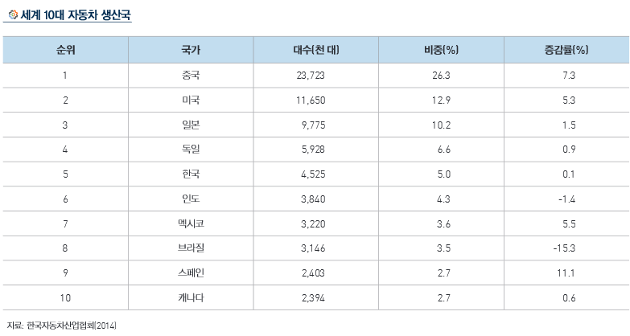

# 차선 이탈 경보 장치의 해외 시장 규모는?

LDWS의 상위 시장인 ADAS의 세계 시장 규모는 조사기관에 따라 규모와 범위에 있어 다소 차이가 있으나 연평균 성장률(CAGR)이
 20%를 상회할 것으로 공통적으로 예측하고 있습니다. 그 중에서도 LDWS는 2019년 장착 의무화를 추진 중이기 때문에 
연평균 성장률이 25%수준으로 예상되어 ADAS 시장 중 연평균 성장률이 가장 높을 것으로 예상됩니다.  

LDWS의 세계 시장 규모는 2015년 3.0억 달러에서 2020년 9.2억 달러 규모로 25.0%의 연평균 성장률로 급격히 커질 것으로 
예상됩니다. 

 

## 참고문서
- KISTI 마켓리포트 : http://kmaps.kisti.re.kr/rpt/findAllFile.do?rptId=2377&metaTypeCd=&metaTypeSeq=&reportGubun=1