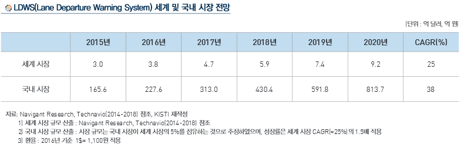

# 차선 이탈 경보 장치시장의 미래 시장 규모는?

LDWS의 세계 시장 규모는 2015년 3.0억 달러에서 2020년 9.2억 달러 규모로 25.0%의 연평균 성장률로 급격히 커질 
것으로 예상됩니다. LDWS 의 국내 시장 규모는 국내 자동차 생산 규모가 세계시장의 5% 비중을 차지하는 점을 감안하여
, LDWS 국내시장 규모도 역시 세계시장의 5%를 점유하는 것으로 추정하였습니다.

자율주행차의 핵심부품 개발에 대한 정부의 다양한 정책들을 고려할 때, 국내 LDWS 시장이 해외보다 급격히 커질 것으로 예상되어, 
국내 시장성장률을 세계 시장의 1.5배 수준인 38%로 상향하여 적용하였습니다. 이를 토대로 국내 시장 규모를 산출해보면, 
2015년 165.6억 원에서 2020년 813.7억 원 규모로 형성될 것으로 전망됩니다. 

 
## 참고문서
- KISTI 마켓리포트 : http://kmaps.kisti.re.kr/rpt/findAllFile.do?rptId=2377&metaTypeCd=&metaTypeSeq=&reportGubun=1