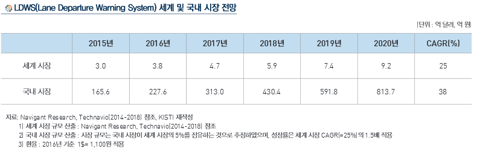

# 차선 이탈 경보 장치시장의 성장률은?

LDWS의 상위 시장인 ADAS의 세계 시장 규모는 조사기관에 따라 규모와 범위에 있어 다소 차이가 있으나 연평균 성장률이 
20%를 상회할 것으로 공통적으로 예측하고 있습니다. 
그 중에서도 LDWS는 2019년 장착 의무화를 추진 중이기 때문에 연평균 성장률
이 25% 수준으로 예상되어 ADAS 시장중 연평균 성장률이 가장 높을 것으로 예상됩니다. 
또한 Technavio(2014~2018) 자료에 따르면 ADAS 시장에서 LDWS가 차지하는 비중은 2012년 기준으로 10% 미만이었으나, 
각국의 교통규제 정책으로 인하여 적용차량이 꾸준히 증가하고 있는 점을 감안하면 2019년 이후에는 ADAS 시장에서
LDWS가 차지하는 비율이 20%를 훌쩍 넘을 것으로 전망됩니다.
 
## 참고문서
- KISTI 마켓리포트 : http://kmaps.kisti.re.kr/rpt/findAllFile.do?rptId=2377&metaTypeCd=&metaTypeSeq=&reportGubun=1