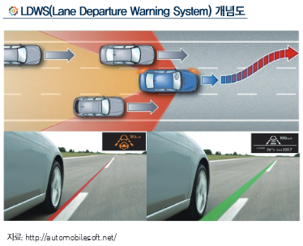

# 차선 이탈 경보 장치 - 개면

차선 이탈 경보 장치(LDWS)는 다양한 ADAS 기능의 하나로 카메라 센서를 이용하여 차선을 감지함으로써 차량 충돌 사고의 주요 원인인 차선 이탈 상황을 감지해 ㄴ운전자에게 진공, 소리, 시각효과 등으로 경고를 해주는 시스템을 의미합니다. 운전자가 방향 지시등 없이 차선 변경을 시도하는 경우 LDWS는 위험 상황이라 판단을 하고 운전자에게 경고를 해주는 것입니다.

LDWS를 위한 카메라는 전방을 주시하기 때문에 센서 모듈은 보통 전면 유리와 룸미러 사이에 장착을 하고 카메라 센서와 카메라로부터 오는 영상을 실시간으로 처리하는 영상처리 알고리즘을 구동하는 ECU(Electronic Control Unit) 및 위험상황 감지시 경고를 줄 수 있는 HMI(Human Machine Interface) 등으로 구성됩니다.  

## 참고문서
- KISTI 마켓리포트 : [http://kmaps.kisti.re.kr/rpt/findAllFile.do?rptId=2377&metaTypeCd=&metaTypeSeq=&reportGubun=1](http://kmaps.kisti.re.kr/rpt/findAllFile.do?rptId=2377&metaTypeCd=&metaTypeSeq=&reportGubun=1)
