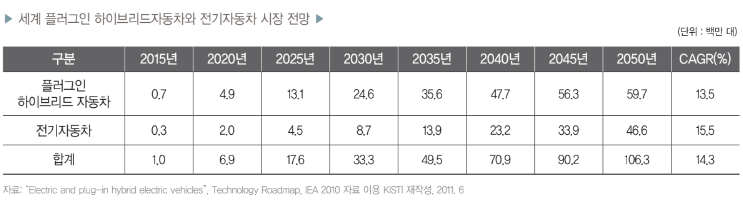
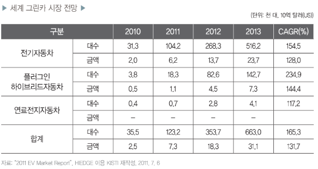
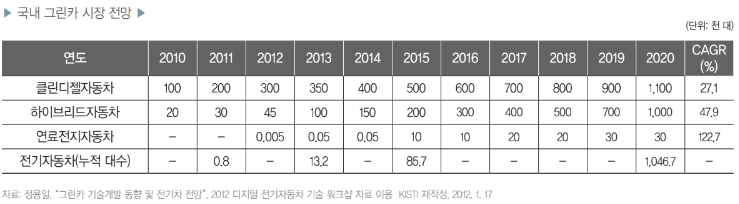

# 친환경자동차 - 성장률

IEA의 기술로드맵 자료에 따르면, 플러그인 하이브리드 자동차 판매는 2015년 70만 대에서 2050년에 5,970만 대 (CAGR 13.5%)로, 전기자동차는 2015년 30만 대에서 2050년에 4,660만 대(CAGR 15.5%)로 증가할 전망입니다. 장기적 으로 볼 때 전기자동차의 연평균성장률이 플러그인 하이브 리드자동차보다 높을 것으로 전망됩니다.

HIEDGE 시장보고서에 따르면, 2013년 전기자동차의 시장 점유율이 가장 높을 것으로 보이며, 다음으로 플러그인 하이브리드자동차와 연료전지자동차 순으로 시장이 형성 될 것으로 예상됩니다. 자동차 대수를 기준으로 2010~2013년 사이에 플러그인 하이브리드자동차의 연평균성장률이 234.9%로 증가폭이 가장 클 것으로 전망됩니다.

국내의 그린카는 하이브리드자동차와 클린디젤자동차를 중심으로 초기 산업이 성장할 것으로 전망되며, 기술 발전과 인프라 구축에 따라 전기자동차와 연료전지자동차 산업이 성장할 것으로 예상됩니다. 클린디젤자동차는 2010년에 10만 대에서 2020년 110만 대(CAGR 27.1%)의 시장이 형성될 것으로 예상되며, 하이브리드자동차는 2010년 2만 대에서 2020년에 100만 대(CAGR 47.9%)가 판매될 전망입니다. 연료전지자동차는 2015년 쯤부터 본격적으로 보급이 실현되어 2020년 쯤 되어야 3만 대 정도의 시장이 형성할 것으로 예상됩니다. 전기자동차의 누적 판매량은 2011년 800대에서 2020년 105만 대로 증가할 것으로 보입니다.

## 참고문서
 - BOSS Report: 12-2012_그린카 시장 전망 및 산업육성을 위한 고려사항.pdf
