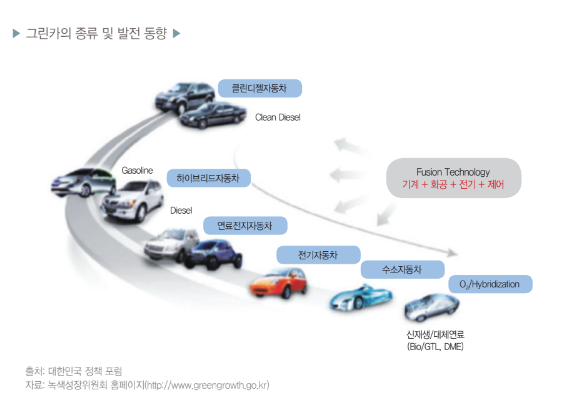

# 친환경자동차 - 개념

현재까지 가솔린자동차와 디젤자동차가 자동차 시장의 대부분을 차지하고 있지만 하이브리드자동차, 전기자동차, 연료전지자동차로 대변되는 그린카는 자동차 기술 개발의 핵심이 되고 있을 뿐만 아니라 자동차 업체가 향후 생존을 위하여 반드시 개발해야 하는 필수 요소로 생각하고 있을 만큼 중요성이 대두되고 있습니다. 향후 자동차 산업은 고연비 차량, 그린카 중심으로 재편될 것으로 예상됩니다. 일반적으로 친환경적이고 이산화탄소(CO2)가 적게 배출되며, 연료소비율이 낮은 자동차를 ‘그린카(Green-Car)’로 지칭합니다. 그린카는 크게 전력기반 차량과 엔진 기반차량으로 나뉘며, 대표적인 차종은 전기자동차(EV), 플러그인 하이브리드자동차(PHEV),하이브리드자동차(HEV), 연료전지자동차(FCEV), 클린디젤자동차(CDV)가 있습니다.

## 참고문서
 - BOSS Report: 12-2012_그린카 시장 전망 및 산업육성을 위한 고려사항.pdf
