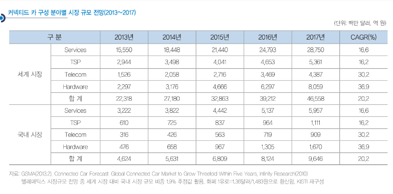

# 커넥티드카 - 국내 시장 규모

각 부문별 2013~2017년의 시장점유율의 변화추이를 살펴보면, 차량 내 서비스부문의 비중이 줄어들면서 텔레매틱스 제
어 유닛과 같은 하드웨어 부분과 텔레매틱스 서비스 제공부문이 증가할 것으로 전망되고 있습니다. 커넥티드 카의 국내 시장규모는 2013년 4,624억 원, 2017년 9,646억 원 규모로 성장할 것으로 예측됩니다.

## 참고문서
- BOSS 보고서: 10-2014-IoT M2M 기술환경 하에서 커넥티드 카 급격한 시장 기대_.pdf
