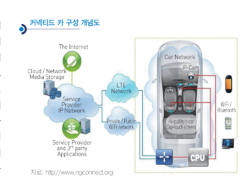
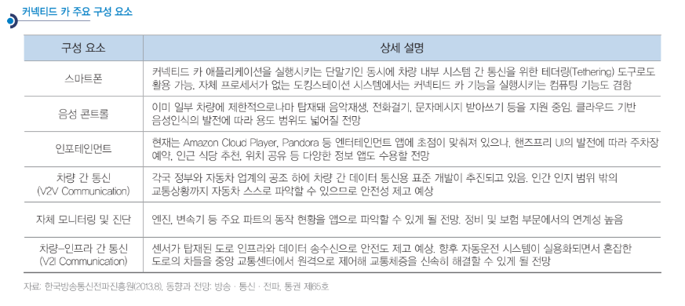

# 커넥티드카 - 개념

'텔레매틱스+인포테인먼트+이동통신 네트워크 기술'이 통합된 형태인 커넥티드 카 서비스는 스마트폰 및 모바일 인터넷
서비스의 확대에 힘입어 점차 대중화되고 있으며, 특히 차량제어/모니터링 서비스는 차량 내에 탑재되고 미디어 콘텐츠
스트리밍 및 다양한 애플리케이션 서비스 등 스마트폰과 차량을연결해 이용하는 형태가 현재로서는 주를 이루고 있습니다. 궁극적으로는 모든 연결성, 플랫폼 및 솔루션이 차량 내에 탑재되어 자동차 자체가 하나의 ‘커넥티드 디바이스’가 되는 형태로 진화해 가고 있는 추세입니다. 차량제어/모니터링/관리서비스와 정보, 내비게이션, 미디어, SNS, 애플리케이션 등 모든 개인용 서비스가 통합 제공될 것으로 예상되어 가까운 미래의 커넥티드 카서비스는 건물, 교통 시스템, 다른 차량 등과도 연결될 것으로 전망하고 있습니다.

## 참고문서
- BOSS 보고서: 10-2014-IoT M2M 기술환경 하에서 커넥티드 카 급격한 시장 기대_.pdf
