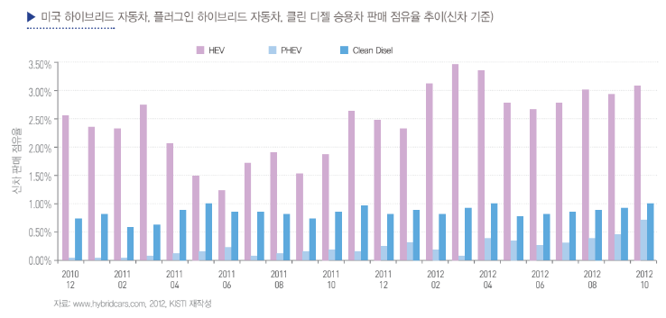

# 클린디젤자동차의 해외 시장 규모는?

미국 시장은 배기가스와 연비에 대한 대응으로 하이브리
드 자동차 시장이 일찍이 활성화되었는데, 1999년 혼다 인
사이트의 17대 판매를 시작으로 해서 2007년 도요타 프리우
스가 18만대가 넘게 팔리는 등 연간 판매량이 35만대를 넘
어섰습니다. 2010년 말까지 미국 시장에서 하이브리드 자동차의
누적 판매량은 189만대에 이르렀으며, 2011년 5월에 200만
대를 넘어섰습니다. 2012년 10월 말 현재, 미국에서 판매된 신차
(승용차)는 1,195만대에 이르렀는데, 이 중에서 하이브리드 신
차는 35만대를 넘어서서 3.0%의 점유율(PHEV를 포함하면
3.3%)을 보이고 있었습니다. 반면 디젤 승용차는 10만대 판매에
그쳐서 0.9%의 점유율을 보였습니다. 

위 그림에서 보면, 2010년
말까지만 해도 하이브리드 자동차와 클린 디젤 자동차의 점
유율이 합하여 3.3%였지만, 2년이 지나지 않은 2012년 말에
는 4.7%까지 증가한 것을 확인할 수 있습니다. 여기서 주목할 만
한 것은 전기 자동차에 거의 근접한 PHEV(Plug-in Hybrid
Electric Vehicle)의 증가 추세입니다. 기존의 하이브리드 자동차
(HEV, Hybrid Electric Vehicle)가 충전을 내연기관으로 했다
면, PHEV는 가정이나 충전소에서 전기 플러그로 충전하는
방식으로 내연기관은 보완적 기능을 합니다. 미국 시장에서도
잘 나타나듯이 2000년대 초반 하이브리드 자동차의 사용화
는 기존의 디젤 엔진에서 클린 디젤 엔진으로 진화시키는 촉
매제 역할을 했지만, 클린 디젤 엔진의 진화는 하이브리드 자
동차의 혁신도 가속시키고 있는 것입니다.

## 참고문서
- 18-2013-지능형 그린자동차-하이브리드 자동차와 클린 디젤 자동차의 경쟁 현황과 미래 예측.pdf