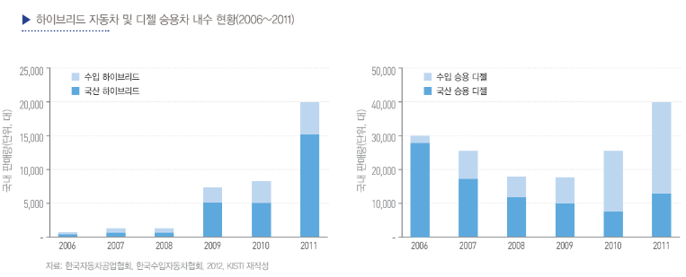

# 클린디젤자동차의 국내 시장 규모는?

현대와 기아자동차는 2009년 7월 LPG 하이브리드인 아반떼
LPi(현대)와 포르테 LPi(기아)를 국내 최초 하이브리드 자동차로
출시한 바 있습니다. 이들 차종의 실적은 실망스러웠는데, 목표 판
매량의 절반을 겨우 넘긴 정도였습니다. 가장 큰 실패 원인은 구매
욕구를 일으킬 만한 차별성이 없었기 때문이었습니다. 이런 실망스
런 경험을 딛고 현대자동차와 기아자동차는 가솔린 하이브리드
인 쏘나타 하이브리드와 K5 하이브리드에서 완전히 새로운 기
술을 탄생시킵니다. 이들의 가장 큰 장점은 전기 모터만으로도 빠
른 주행이 가능하다는 것입니다. 더욱이 자동차 무게도 경쟁사들
에 비해 가벼웠는데, 경쟁사들이 하이브리드 자동차에 주로 장
착하는 니켈-메탈 배터리 대신 리튬이온 폴리머 배터리를 사용
했기 때문입니다. 이것이 현대자동차와 기아자동차가 쏘나타 하
이브리드와 K5 하이브리드의 연비를 크게 높일 수 있었던 원인
이었습니다. 그러나 새로운 기술이 시장을 개척하는 데 있어서 문제
는 가격과 소비자 신뢰였습니다. 하이브리드 자동차의 높은 가격은
정부 지원과 제조사의 파격적인 가격 할인을 통해 거의 일반
신차의 가격에 근접시킬 수 있었습니다. 또한 소비자의 신뢰는 중
고차 가격 보장 프로그램과 하이브리드 전용 부품에 대한 무
상보증서비스를 크게 확대하는 프로모션을 통해 어느 정도
극복할 수 있었습니다. 이러한 노력으로 2012년 9월 하이브리드
자동차의 내수 점유율이 2.5%(수입차 제외)를 넘었는데, 이는
우리 시장보다 역사가 10년 이상 앞선 미국 시장의 수준에
거의 육박한 것으로 고무적인 증가라고 볼 수 있습니다.
클린 디젤 승용차(SUV 제외)의 경우 국내 시장의 양상은
하이브리드 자동차와는 달라서 2000년대 중반 오히려 내수
판매가 정점이었으며, 2007년 이후 감소세를 보였습니다. 

위 그림에서 보면, 2009년 이후 하이브리드 자동차의 국내 시장은
국산 승용차가 주도한 반면, 디젤 승용차는 수입차가 주도하
는 양상으로 바뀐 것입니다. 2011년 한 해만 본다면 국산 하이
브리드 자동차보다 수입산 디젤 승용차가 2배 이상 많이 팔
려서 디젤 승용차가 다시 주도권을 잡기 시작한 것처럼 보입니다.

## 참고문서
- 18-2013_지능형_그린자동차_하이브리드_자동차와_클린_디젤_자동차의_경쟁_현황과_미래_예측.pdf