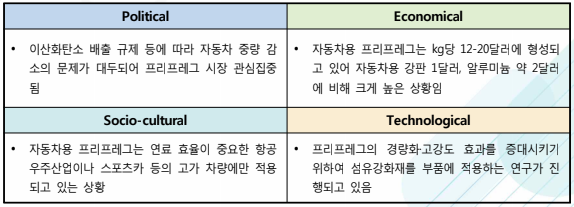

# 프리프레그 시장의 PEST 분석은?

정치 경제 사회 기술
정치적 분석입니다.
이산화탄소 배출 규제 등에 따라 자동차 중량 감소의 문제가 대두되어 프리프레그 시장 관심이 집중되고 있습니다. 

경제적 분석입니다.
자동차용 프리프레그는 kg당 12-20달러에 형성되고 있어 자동차용 강판 1달러, 알루미늄 약 2달러에 비해 크게 높은 상황 입니다.

사회적 분석입니다.
자동차용 프리프레그는 연료 효율이 중요한 항공 우주산업이나 스포츠카 등의 고가 차량에만 적용되고 있는 상황입니다.

기술적 분석입니다.
프리프레그의 경량화·고강도 효과를 증대시키기 위하여 섬유강화재를 부품에 적용하는 연구가 진행되고 있습니다.

## 참고문서
- 25-2016-자동차용 프리프레그.pdf