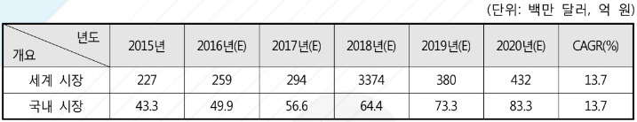

# 프리프레그 - 성장률

프리프레그 사용은 우주항공 합성물의 사용과 함께 시작되었습니다. 20세기 중반까지는 프리프레그 제조는 우주항공 산업에 적용함에 있어서 개발 단계였으며 20세기 후반에 우주항공 산업에서 특별한 부품으로 사용되면서 프리프레그의 상업적인 활용이 시작되었습니다. 또한, 풍력 발전, 자동차 산업에서의 프리프레그 활용을 위한 시범 사업이 시작되었으며 비행기에서 프리프레그의 사용이 증가하였습니다.

카본 섬유, 유리 섬유, 아라미드 섬유 프리프레그를 포함한 세계 프리프레그 시장은 상대적으로 빠르게 성장하고 있으며, 기술적으로 진화하고 있는 분야입니다. 우주항공, 재생 가능 에너지(특히 풍력), 운송 산업 등 최종 적용 분야의 새로운 응용 산업은 앞으로 시장의 성장을 이끌어 나갈 것이라 기대됩니다. 카본 섬유 프리프레그의 시장 점유율은 매우 높고 유리 섬유 프리프레그의 시장 점유율은 전반적인 프리프레그 시장의 성장을 지속시킬 것으로 예상됩니다. 프리프레그 전체 시장의 규모는 2020년 6,971.3백만 달러에 이를 것으로 예상되며, 2015년과 2020년 사이에 연평균 성장률이 10.7%에 다다를 것으로 보입니다.
우주 및 방산, 차량, 풍력발전 분야에서의 프리프레그에 대한 요구가 증가함에 따라, 2014년 107.0킬로톤에 이르던 생산량이 2020년에는 173.6킬로톤에 이르며, 2015년과 2020년 사이에 연평균 성장률 8.4%에 이를 것으로 보입니다.

자동차 산업에서 프리프레그 시장은 가장 높은 성장 잠재력을 가지면서 시장을 성장시키고 있습니다. 프리프레그는 높은 비용 때문에 오직 레이싱 자동차나 고급의 전기 자동차에서만 최근에 사용되었으나 저비용의 카본 섬유를 위한 R&D(연구개발)의 노력이 성공하면, 자동차 산업에서 프리프레그의 수요는 기하급수적으로 늘 것으로 예상됩니다. 2014년에 약 200백만 달러로 추정되고, 2015년 약 227백만 달러부터 2020년까지 연평균 성장률 13.7%로 성장하여 2020년까지 약 432백만 달러에 도달할 것으로 예상됩니다. 자동차 분야에서 프리프레그의 가장 큰 소비자는 유럽으로, 유럽은 자동차 응용분야의 프리프레그 시장에서 주요한 몫을 차지하는데 이것은 유럽 지역에서 고급 자동차 제조업체를 보유하고 있기 때문이라고 판단됩니다. 국내 시장의 경우 2014년 세계 자동차 판매량 대비 국내 판매량 비 1.74%를 적용하면 2015년 약 43.3억 원 규모에서 2020년 약 83.3억 원 규모로 성장할 것이 예측됩니다.

## 참고문서
- BOSS Report: 25-2016-자동차용 프리프레그.pdf
