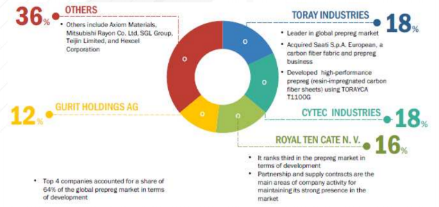

# 해외 프리프레그 시장의 기업별 점유율은?

프리프레그 시장은 TORAY INDUSTRIES, CYTEC INDUSTRIES, ROYAL TEN CATE, GURIT HOLDINGSAG 등이 전체 시장의 64%를 차지하고 있는 것으로 나타납니다.
 
TORAY INDUSTRIES는 유기화학, 고분자 화학, 생화학 기술 전문 업체로 탄소섬유 복합재료 부문에서의 프리프레그 사업을 운영하고 있습니다.
TORAY INDUSTRIES는 세계 25개국에 215개의 자회사를 보유하고 있습니다.
CYTEC INDUSTRIES는 특수 재료 및 화학 기술 분야의 선두 공급업체입니다.  주로 항공 우주 재료, 산업자재, 분리·첨가제 제품을 주력으로 하고, 북미, 라틴 아메리카, 아시아·태평양 등지의 분산된 유통구조를 가지고 있습니다.
ROYAL TEN CATE는 화학 공정기술과 섬유기술을 결합한 기능성 재료, 모듈 및 시스템을 제조하는 회사이며 주로 항공 우주 및 자동차 산업에서 탄소 프리프레그 시장에 주력하고 있습니다.
ROYAL TENCATE는 네덜란드의 우주항공 산업 업체인 Fokker International Aerospace Industry와 합작하여 수익의 극대화를 노리고 있습니다.
GURIT HOLDINGS AG는 복합 재료, 엔지니어링 서비스, 금형 장비, 선택 부품 및 시스템 공급 업체입니다.
GURIT HOLDINGS AG는 프리프레그의 자동차 재료, 구조 코어 재료, 접착제, 수리 솔루션 등의 다양한 제품을 제공하고 있습니다.
Gurit은 스위스, 독일, 영국, 캐나다, 스페인, 호주, 뉴질랜드, 미국, 에콰도르, 브라질, 인도, 중국에 생산 공장 및 사무소를 두고 있습니다.

## 참고문서
 - 25-2016-자동차용 프리프레그.pdf
