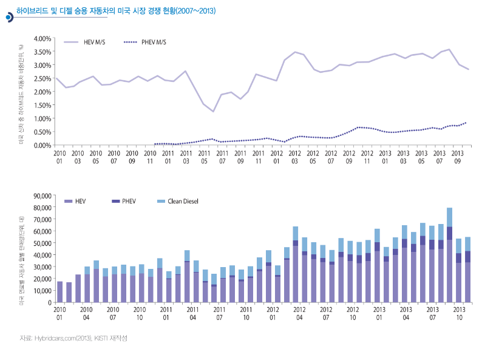

# 하이브리드 자동차 해외 시장의 시장 크기는?

현재 하이브리드 자동차 시장의 진검승부는 미국 시장을 중
심으로 진행되고 있습니다. 일본 내수 시장도 상당히 큰 규모로 성
장했지만, 자국산 차량 위주의 경쟁이라는 측면에서 볼 때, 하
이브리드 자동차의 경쟁력을 판단하기에는 미국 시장이 보다
객관적이라고 할 수 있습니다. 사실 대체 연료 자동차 시장에서 국
내 시장은 LPG 자동차 시장이 세계적인 경쟁력을 가지고 있습니
다. 미국 시장에서 하이브리드 자동차는 최근 3년 비교적 견고
한 점유율 확대를 보이며, 2012년 한 해 시장규모가 487,085대
에 이르렀습니다. 

특히 PHEV(Plug-in Hybrid Electric Vehicle, 플러그인 하이
브리드 자동차)까지 판매점유율을 높이면서, 하이브리드 자동
차는 신차 판매 비중의 4%를 차지하게 되었습니다. 여기서 PHEV
는 자동차에 연결된 전기코드를 일반 가정용 콘센트에 꽂아 배
터리를 충전한 뒤 주행하는 하이브리드 자동차를 의미하는데,
아직 내연기관을 보조로 구비하고 있다는 측면에서 하이브리드
자동차로 구분됩니다.
미국 하이브리드 자동차 판매점유율에서 주목되는 또 한 가
지 경향은 2011년도 중반에 나타난 판매 감속 추세입니다. 2011년
초 일본에서 대지진이 일어나면서 프리우스를 비롯한 주력 차
종의 생산이 여의치 않았고, 토요타 자동차 품질에 문제가 생
기면서 전반적으로 일본 자동차의 판매가 저조했습니다. 특히 프리
우스 등 기존 하이브리드 자동차 모델의 노후화로 미국에서 하
이브리드 자동차 판매는 위기를 맞았습니다. 2010년에는 미국에서
시판되는 하이브리드 자동차 모델이 30개에도 못 미쳤으며, 프
리우스의 점유율도 51.4%로 매우 높아서 특정 차종의 위기가
전체 시장에 크게 영향을 줄 수밖에 없었습니다. 그러나 2013년 현
재는 모델이 45개를 넘었으며, 프리우스의 점유율도 45.9%로
낮아져서 범위의 경제가 어느 정도 달성되고 있는 것을 확인할
수 있습니다.
유럽과 달리 미국은 전통적으로 경제성 등의 이유로 디젤
엔진 자동차에 대한 선호가 높지 않았습니다. 최근 디젤 승용차에
대한 수요가 증가하기는 했지만, 하이브리드 자동차에는 미치지
못하며, 심지어 PHEV와 비슷한 수준의 점유율을 보이기도 했습니다.

## 참고문서
- 14-2014-하이브리드 자동차의 위기와 기회.pdf