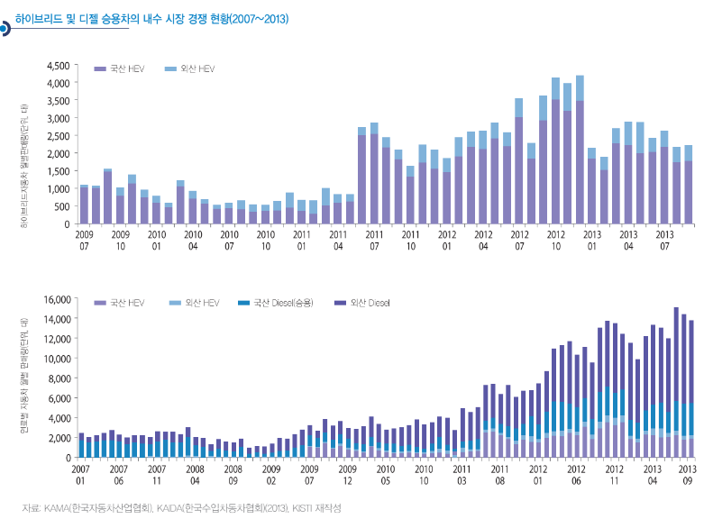

# 하이브리드 자동차 해외 시장의 시장 크기는?

국내에서는 국산 하이브리드 자동차를 중심으
로 한 하이브리드 자동차의 위기론이 대두되고 있습니다. 실제로
2012년 12월 이후 국산 하이브리드 자동차는 눈에 띄게 판매량
이 줄어들었으며, 2012년의 판매량 성장세가 2013년에 들어서
좀처럼 회복되지 못하고 있습니다. 또한 내수용 국산 신차 판매량
에서 하이브리드 자동차가 차지하는 비중을 살펴보면, 판매량의
추이와 거의 같습니다. 이 점은 하이브리드 자동차 판매의 하락세가
자동차 전체 시장의 문제라기보다는 국산 하이브리드 자동차가
가지는 문제점임을 판단하게 해주는 것입니다.

가장 먼저 원인으로 생각할
수 있는 것은 국내 시장에 판매되는 하이브리드 차종의 부족
입니다. 2013년 9월 현재 판매되고 있는 국산 하이브리드 자동차
는 소나타, K5, 알페온, 아반떼 등이며, 외산의 경우는 토요타
만 적극적으로 판매에 나서고 있는 실정입니다. 그런데 하이브
리드 자동차 시장이 보다 활성화된 미국에서는 2012년말 당시
40종이 넘는 하이브리드 자동차 모델이 판매되고 있었습니다. 즉,
2012년 국내에서는 10개 남짓의 모델로 4만 대에 가까운 하이
브리드 자동차가 판매되었지만, 미국에서는 40개 이상의 모델
로 48만 대 이상의 하이브리드 자동차가 판매되었습니다.
미국은 규모의 경제와 범위의 경제가 달성된 반면, 국내 시
장은 규모나 종류에서 시장의 확대에 한계가 있는 것입니다. 반면
디젤 승용차는 국내에서도 다수의 차종이 계속 출시되고 있었기
때문에 오히려 범위의 경제라는 측면에서 하이브리드 자동차
를 압도할 수밖에 없었던 것입니다. 따라서 국산 하이브리드 자
동차의 수출 확대를 통한 규모의 경제 달성과 출시 모델의 확
대를 통한 범위의 경제 확보가 국내 시장 확대를 위하여 절실
합니다.

## 참고문서
- 14-2014_하이브리드_자동차의_위기와_기회.pdf