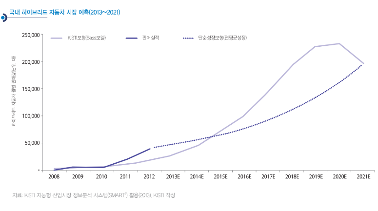

# 하이브리드 자동차 - 성장률

앞서 살펴본 바와 같이 국내 하이브리드 자동차는 분명히 성장이 더뎌지고 있습니다. 자동차 시장 규모가 선진국에 비해 작아 규모의 경제를 실현하기 쉽지 않고, 또한 시판 모델도 적어서 범위의 경제도 실현되지 못하고 있습니다. 더군다나 디젤유의 가격까지 가솔린유보다 낮아 디젤 승용차와의 경쟁도 어려워
지고 있는데, 국내 교통 상황과 운전자의 운전 습관은 하이브리드 자동차의 매력을 더욱 퇴색시키고 있습니다. 국내에서 하이브리드 자동차는 소비자의 관심에서 점점 멀어지고 있는 것입니다. 국산 하이브리드 자동차의 수출 확대를 통한 규모의 경제 달성과 출시 모델의 확대를 통한 범위의 경제 확보가 절실한 시점입니다.

최근 국내 시장의 판매량과 이런 부정적인 경쟁상황을 고려하여, 향후 국내 하이브리드 자동차 시장을 추정한 결과가 아래 그래프에 제시되었습니다.

먼저 Frost & Sullivan(2012)이 북미 시장에서 하이브리드 자동차(PHEV 포함)가 연평균(CAGR) 19.7% 성장할 것으로 제시한 결과를 바탕으로 단순성장모형(연평균성장률)으로 추정된 결과를 점선으로 표시하였고, 현재의 부정적인 경쟁상황과 소비자의 관심 부족을 고려해 KISTI 모형으로 최대잠재시장규모
를 추정한 예측 결과를 Bass모델로 제시하였습니다.

두 예측 모형 모두 2021년에는 19만 대에 이르는 시장규모를 예측하고 있지만, 두 예측의 가장 큰 차이는 장기적인 관점에서 KISTI 모형(Bass모델)은 시장 성장의 한계를 예측하고 있다는 것입니다. 공통적으로 2020년까지 어느 정도 성장은 이어가겠지만, KISTI 모형은 그 후에는 시장에서 경쟁력을 상실할 것으로 예측하고 있습니다. 실제로 2013년 9말까지 9개월 동안의 판매현황은 KISTI 모형(Bass모델)에 가까운 판매 현황을 보이
고 있습니다.

물론 하이브리드 자동차의 성장 한계를 극복할 수 있는 기회는 분명히 다가올 것입니다. 먼저 미국 시장에서와 같이 PHEV 개발과 시판이 새로운 기회를 제공할 것입니다. PHEV가 가지는보다 높은 연비 효율성은 소비자에게 매력적일 수 있습니다. 그러나 국내 거주 형태가 아파트 중심인 것은 PHEV의 보급 확대에 또 다른 걸림돌이 될 수 있습니다.

오히려 국내 하이브리드 자동차 시장에서 또 다른 전환점은 디젤 하이브리드 자동차가 될 수 있습니다. 비록 외산(벤츠) 하이브리드 자동차를 중심으로 시판이 시도되고 있지만, 외산 승용차 를 중심으로 디젤 엔진에 대한 인식이 많이 개선되었다는 측면에서 볼 때 디젤 하이브리드 자동차는 또 다른 시장 확대 기회가 될 수 있는 것입니다.

## 참고문서
- BOSS Report: 14-2014-하이브리드 자동차의 위기와 기회.pdf
